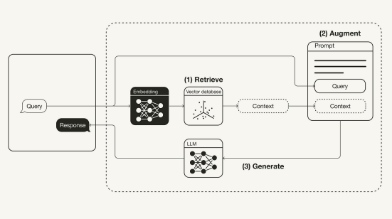
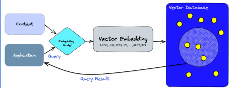
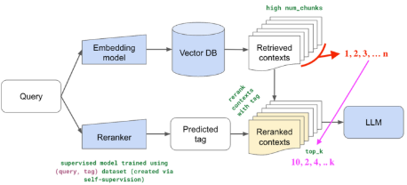
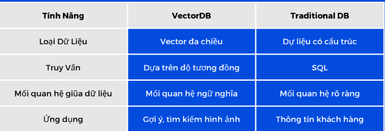
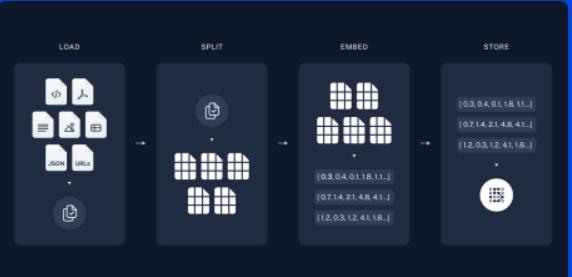
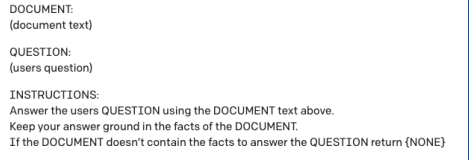

# RAG là gì ?
`Retrieval Augmented Generator` là 1 kĩ thuật/pipeline cho phép LLM kết nối với các kiến thức bên ngoài, tăng độ chính xác và chất lượng của câu trả lời. RAG gồm 3 thành phần chính:

- Retrieve: Khôi phục các kiến thức liên quan
- Augment: Chuyển hoá dữ liệu liên quan thành dữ liệu có nghĩa cho LLM.
- Generate: Tạo ra câu trả lời mới dựa trên kiến thức đã khôi phục

# Retrieve  - Truy xuất
- Đây là phần quan trọng nhất của RAG 
- Do LLM không thể truy vấn một số thông tin từ nguồn bên ngoài, chúng ta buộc phải sử dụng các kĩ thuật truy vấn để đưa thông tin cho LLM 
- Một hệ thống truy vấn tốt `RẤT QUAN TRỌNG`, do thông tin đưa cho LLM bị sai, câu trả lời sẽ sai hoàn toàn. 
- Đa số các hệ thống truy vấn RAG hiện tại sử dụng `vector database` để làm truy vấn

# Augment - Lọc và xử lí
- Sau khi truy vấn ra đúng phần dữ liệu, lọc và xử lí những dữ liệu được truy vấn cũng rất quan trọng.
- Việc này giúp loại bỏ các thông tin không cần thiết/không liên quan để LLM có thông tin tốt hơn để đưa ra câu trả lời.
- Một trong những phương pháp phổ biến nhất là `Reranking`.

# Generation - Tạo văn bản
- Dựa trên thông tin truy vấn và đã xử lí, LLM sẽ đưa ra câu trả lời để đáp ứng câu hỏi của người dùng.
- Nhờ có những thông tin đã được truy vấn và lọc cẩn thận, câu trả lời từ LLM sẽ chuẩn xác hơn
- Bước này thường dựa vào `prompt engineering`

# Vector, Embeddings & VectorDB

# Mô hình BERT
- Khác với LLM, embeddings của văn bản thường được sinh ra nhờ mô hình có kiến trúc BERT
- BERT không có quá nhiều ý nghĩa trong việc tạo sinh văn bản , nhưng rất tốt trong việc lưu trữ những thông tin mang ngữ nghĩa cao. 
- Train một mô hình BERT thường chỉ bằng 1/100 giá train LLM.

# Vector Embeddings
- Vector Embeddings là một tập hợp số được dùng để biểu diễn ngữ nghĩa hoặc thông tin của một loại data.

# Vector Database 
Giống với Database truyền thống. Vector Database là nơi lưu trữ các vector embeddings

# Các bước để tạo ứng dụng RAG với Langchain

## Bước 1: Indexing
- Quá trình load, xử lí và đưa dữ liệu riêng vào vector database.
- Có thể coi đây là quá trình nạp thêm dữ liệu cho LLM.

## Bước 2: Prompt Engineer và Generation
- Sử dụng dữ liệu truy vấn để làm `prompt engineering`

## Langchain Modules
- TextSplitters & DocumentLoaders: Cho phép đọc và xử lí các loại
Document khác nhau (PDF, DocX, txt)
- VectorStore: Tích hợp sẵn các VectorStore phổ biến trên thị
trường (ChromaDB, FAISS, etc.)

[Làm quen với Embedding và miniRAG](https://colab.research.google.com/drive/13_cYcPDeNeR7iuy3hyp9T7vUWNxa4xOV?usp=sharing#scrollTo=ItBWjQbyThis)

[Xây dựng chatbot dựa trên văn bản tuỳ ý](https://colab.research.google.com/drive/1TlcyUTz9tmgfxI_-4V9faAjbCuGWeTuh?usp=sharing)