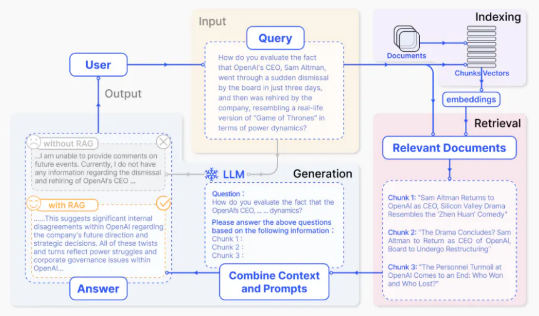
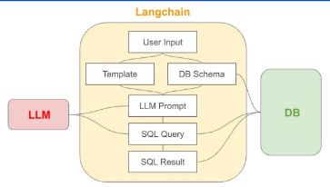
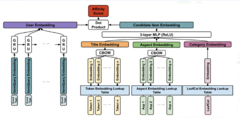
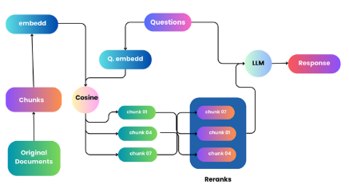
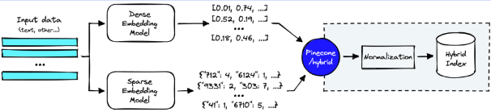

# Buổi 3: Cải tiến chất lượng với các kĩ thuật Advanced RAG

# Hạn chế của RAG
- Độ chính xác thấp (Các phần trích xuất không phù hợp)
- Độ phủ thấp (Không trích xuất được các phần liên quan)
- Khả năng sử dụng thông tin lỗi thời dẫn đến hiện tượng ảo giác và phản hồi không chính xác.
- Phụ thuộc quá mức vào thông tin bổ sung trong quá trình sinh văn bản.

# Vì sao cần đến RAG nâng cao
- Cải thiện chất lượng trích xuất thông qua các quy trình tối ưu hoá trước, trong và sau khi trích xuất.
+ Trước: tăng cường tính chi tiết của dữ liệu
+ Trong: tối ưu hoá các mô hình embedding để hiểu ngữ cảnh tốt hơn
+ Sau: giải quyết các giới hạn của cửa sổ ngữ cảnh và thông tin nhiễu thông qua việc reranking và nén prompt

# Tối ưu trước Retrival

Đây là phương pháp được sử dụng nhiều nhấtdo sử dụng ít tài nguyên tính toán, dễ trong việc triển khai cũng như cho độ chính xác ở mức chấp nhận được.
Ví dụ:

- SQL Query Generation: Có thể cung cấp schema của SQL cho ChatGPT và biến câu query từ ngôn ngữ tự nhiên thành SQL Query
- Tối ưu prompt: Cho LLM xử lí lại câu hỏi của người dùng để hệ thống embedding hiểu hơn.

# Tối ưu trong Retrieval
- Embeddings là một “bộ lọc thông
minh”. Nếu có thể sử dụng thêm dữ
liệu của finetune mô hình này, nó
sẽ giúp mô hình hiểu hơn về ngữ
cảnh của từng bài toán.
- Sau khi finetune, mô hình sẽ trả về
các embedding mang ngữ nghĩa
phù hợp hơn với hoàn cảnh của bài
toán.

# Tối ưu sau Retrieval - Reranking
- Cosine Similarity có ý nghĩa trong
việc tìm ra những thứ liên quan,
nhưng không chắc là thứ liên quan
nhất
- Kỹ thuật này liên quan đến việc sắp
xếp lại các phần văn bản đã trích
xuất dựa trên mức độ liên quan và
phù hợp với truy vấn.

# Hybrid Search - BM25 + Vector Embeddings
- BM25 là một phương pháp search theo keyword rất phổ biến ở giai đoạn đầu của NLP
- BM25 tính độ tương đồng dựa trên số lần lặp lại của từ khoá trong một câu
- Điểm vượt trội của BM25 nằm ở việc nó có thể cân bằng sự thiên vị giữa các từ khác xuất hiện nhiều lần và các từ hiếm khi xuất hiện
- Ngoài ra, BM25 cũng cân bằng được sự mất cân bằng trong độ dài văn bản.
