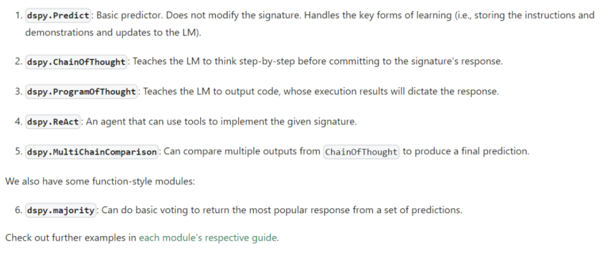
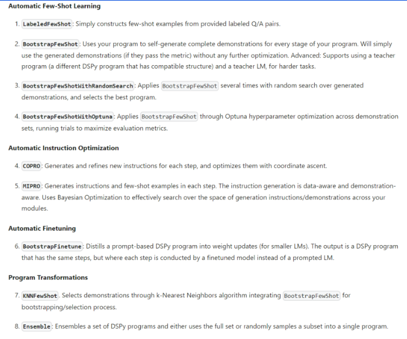

# Large Action Model là gì?
- Mô hình học máy được tạo ra để thực hiện các hành động phức tạp.
- Kết hợp các kĩ thuật học máy, thị giác máy tính, xử lí ngôn  ngữ tự nhiên và điều khiển robot.
- Mục tiêu giúp robot và máy móc tương tác với môi trường và thực hiện nhiệm vụ một cách tự chủ.

# Cách hoạt động của Large Action Model
- Nhận đầu vào: Dữ liệu cảm biến (hình ảnh, video, âm thanh) thônng tin về ngữ cảnh.
- Xử lí: Phân tích dữ liệu, xác định hành động phù hợp, lập kế hoạch và điều khiển robot
- Thực hiện: Điều khiển robot thực hiện hành động của chúng trong môi trường  thực tế.
- Học tập: Cải thiện hiệu suất thông qua kính nghiệm và tương tác với môi trường.

# Long Context Length trong LLM
- Định nghĩa: Chiều dài tối đa của chuỗi đầu vào mà LLM có thể xử lí.
- Tầm quan trọng: Cho phép LLM hiểu rõ hơn ngữ cảnh của một câu hoặc đoạn văn, từ đó tạo ra kết quả tốt hơn

# Kim trong đống rơm (The Needle In a Haystack Test)
Bài kiểm tra về hiệu năng của LLM, đánh giá độ chính xác và hiệu quả của LLm trong việc tìm kiếm.

# Giới thiệu về DSPy
## DSPy - Hệ thống tối ưu hoá mô hình ngôn ngữ lớn.
- DSPy hệ thống hoá quy trình làm việc với mô hình ngôn ngữ lớn 
- Phân biệt cấu trúc chương trình với tham số LM, giúp code linh hoạt hơn.
- Sử dụng thuật toán dựa trên LM để tối ưu hoá prompt và trọng số cho kết quả tốt hơn.

## Tại sao DSPy là bước ngoặt đột phá
- `Translate`, `Optimizer`, `Interate`. Dễ dàng thích ứng với sự thay đổi mà k cần điều chỉnh prompt
- Nhận kết quả chất lượng cao hơn. DSPy đào tạo LM đạt đến độ chính xác và tin cây cao hơn.

## Các building Block của DSPy
- DSPy có 8 thành phần chính:
    - Language Model
    - Signatures
    - Modules
    - Data
    - Metrics
    - Optimizers
    - DSPy Assertions
    - Typed Predictors

## Signature - Xác định hành vi của mô hình ngôn ngữ
- Định nghĩa chữ kí  (Signature): Signature là cách mô tả rõ ràng những gì đầu vào/đầu ra ta mong đợi từ các module DSPy.
- Focus vào 'cái gì' , khônng phải 'như thế nào': Thay vì phải chỉ cách LM thực hiện tác vụ, Signature giúp chúng ta tập trung vào mô tả trực tiếp tác vụ đó.
- So sánh với chữ kí hàm số: Tương tự như chữ kí hàm số, DSPy Signature xác định đầu vào, đầu ra nhưng còn chủ động kiểm soát hành vi của các module.

## Modules 
- DSPy Modules cho phép thay thế nhanh các kĩ thuật prompting phức tạp.
- Thích hợp để xây dựng các hệ thống agent cần nhiều tính quyết định.
- Modules đi kèm rất nhiều kiểu prompting khác nhau

# DSPy Optimizer
- DSPy Optimizer: Thuật toán tự điều chỉnh các thông số trong chương trình DSPy (như lời nhắc, trọng số LLM) để tối đa hoá các chỉ số đánh giá hiệu suất do bạn cung cấp.
- 3 yếu tố quan trọng:
    - Chương trình DSPy của bạn
    - Chỉ số đo lường (hàm đánh giá đầu ra và chấm điểm -  điểm càng cao càng tốt)
    - Một vài dữ liệu huấn luyện (có thể rất nhỏ hoặc không đầy đủ)
- DSPy Optimizer có thể bắt đầu tối ưu từ dữ liệu ít và vẫn cho kết quả tốt.

## DSPy Optimizer tối ưu hoá gì ? Bằng cách nào?
- So sánh với mạng nơ-ron truyền thống: Thuật toán gradient - descent được dùng để tối ưu mạng nơ-ron dựa trên hàm mất mát và dữ liệu cho trước.
- Chương trình DSPy: Gồm nhiều lời gọi mô hình ngôn ngữ kết hợp với nhau. Mỗi module DSPy có 3 loại thônng số:
    - Trọng số LLM
    - Instruction cho LM
    - Các trường hợp minh hoạ đầu vào/đầu ra mong đợi.
    